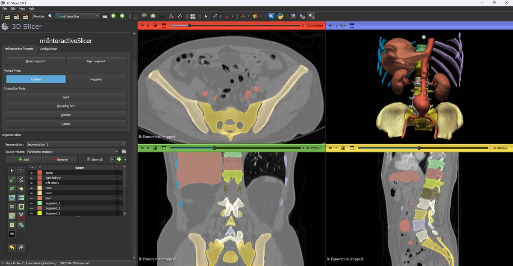
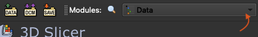
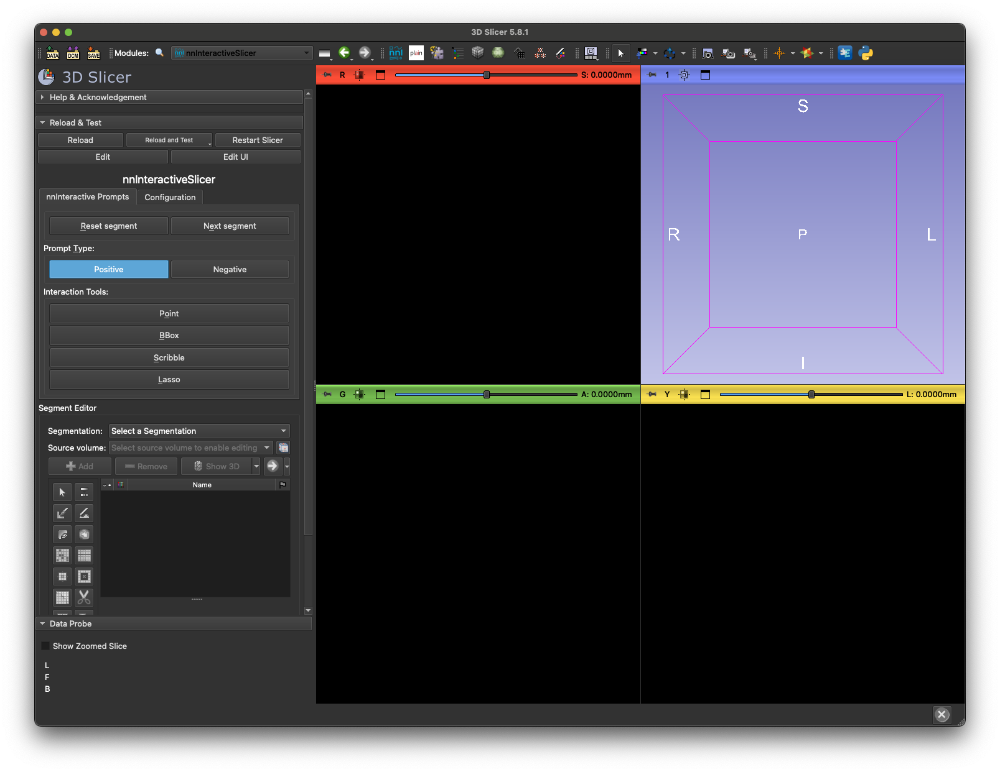

# `SlicerNNInteractive`: nnInteractive meets 3D Slicer

This repository makes [nnInteractive](https://github.com/MIC-DKFZ/nnInteractive) available in [3D Slicer](https://www.slicer.org/). nnInteractive is a deep learning-based framework for interactive segmentation of 3D images, allowing for fast voxel-wise segmentation using prompts like points, scribbles, bounding boxes, and lasso. You can read more about nnInteractive in the [ArXiv paper](https://arxiv.org/abs/2503.08373), or in the original [GitHub repository](https://github.com/MIC-DKFZ/nnInteractive). 3D slicer is a free and open source medical image viewer, and can be downloaded [here](https://download.slicer.org/).

[](https://arxiv.org/abs/2504.07991)



## Video tutorial

https://github.com/user-attachments/assets/c9f9ee0a-f74d-4907-aa21-484dcfd10948

## Table of contents

- [Compute modes](#compute-modes)
- [Installation](#installation)
  - [Install the extension in 3D Slicer](#install-the-extension-in-3d-slicer)
  - [First run: choose what to install](#first-run-choose-what-to-install)
  - [Updating or changing the installed backend](#updating-or-changing-the-installed-backend)
  - [Running the official server (Remote mode)](#running-the-official-server-remote-mode)
- [Usage](#usage)
  - [Editing an existing segment](#editing-an-existing-segment)
  - [Keyboard shortcuts](#keyboard-shortcuts)
- [Common issues](#common-issues)
- [Testing](#testing)
- [Contributing](#contributing)
- [Development](#development)
- [Citation](#citation)
- [License](#license)
- [Acknowledgements](#acknowledgements)

## Compute modes

This extension targets **nnInteractive v2** and drives the official
[`nnInteractive`](https://github.com/MIC-DKFZ/nnInteractive) inference code directly — it no
longer ships its own server. Upstream is now split into two pip packages that share the
`nnInteractive` namespace:

- **`nninteractive-client`** — a lightweight, **torch-free** remote client (`numpy` / `httpx` /
  `blosc2` only). This is all Slicer needs in Remote mode.
- **`nnInteractive`** — the **full** local-inference + server stack (PyTorch, nnU-Net, …). It
  depends on `nninteractive-client`, so a full install includes the client too.

Accordingly, you can run inference in two ways:

- **Local mode** — inference runs **in-process inside Slicer's Python** via the full
  `nnInteractive` package. No separate server is needed, but Slicer's Python must have the full
  nnInteractive + PyTorch stack, so you need a machine with a (preferably NVIDIA) GPU. 10 GB of
  VRAM is recommended; small objects work with <6 GB. CPU is supported but slow.
- **Remote mode** — Slicer is a **lightweight client** (just `nninteractive-client`, no PyTorch)
  that talks to an `nninteractive-server` running on a GPU machine (which may be the same
  computer).

The first time you open the module, a dialog asks **what to install** (see
[First run](#first-run-choose-what-to-install)). Installs are always explicit — they happen only
from that dialog or the `Reinstall / Update nnInteractive` button in the `Configuration` tab, never
silently in the background. A **Client-only** install keeps Slicer PyTorch-free and leaves Local
mode disabled; a **Full** install enables both Local and Remote, and you can switch between them at
any time with the toggle in the `Configuration` tab (toggling never triggers an install).

## Installation

### Install the extension in 3D Slicer

1. [Download and install the latest version of **3D Slicer**](https://slicer.readthedocs.io/en/latest/user_guide/getting_started.html#installing-3d-slicer).
2. [Install the **nnInteractive** extension](https://slicer.readthedocs.io/en/latest/user_guide/extensions_manager.html#install-extensions) from the Extensions Manager.
   (For development without the Extensions Manager, see [Development](#development).)

### First run: choose what to install

The first time you open the `nnInteractive` module, a dialog asks **what to install** into Slicer's
Python. Nothing is installed until you choose, and nothing is ever installed lazily in the
background:

- **Full (local + remote)** → installs the full **`nnInteractive`** package (nnU-Net + model code)
  **and PyTorch**. This enables **both** Local and Remote mode. Pick a model in the `Configuration`
  tab — the dropdown is populated from the available-models manifest — and on the first local
  segmentation its weights are downloaded automatically from
  [Hugging Face](https://huggingface.co/MIC-DKFZ/nnInteractive).
- **Client only (remote)** → installs just the torch-free **`nninteractive-client`** package (plus
  the `httpx` / `blosc2` / `scikit-image` wire stack). **No PyTorch.** Local mode stays disabled;
  enter your server URL (and API key, if any) in the `Configuration` tab.

After installing, click `Initialize` at the top of the `nnInteractive Prompts` tab — this loads the
model (Full/Local) or connects to the server (Remote). If you dismiss the dialog without choosing,
nothing is installed, the dialog reappears next time you open Slicer, and `Initialize` will ask you
to install first.

> [!NOTE]
> The extension only ever installs `nnInteractive` / `nninteractive-client` **below v3.0.0**, to
> guard against future API changes.

**PyTorch (Full installs).** A Full install pulls in PyTorch (and `torchvision`) automatically,
preferring Slicer's **PyTorch extension** (`PyTorchUtils`): it selects a torch build matched to your
GPU driver via [light-the-torch](https://github.com/Slicer/light-the-torch) on every platform. The
PyTorch extension is installed automatically when missing, which may require **one Slicer restart** —
afterwards, choose `Full (local + remote)` again to finish. Without the PyTorch extension (e.g.,
offline), the install falls back to plain pip: on **Windows** it pulls from PyTorch's CUDA wheel
index (`https://download.pytorch.org/whl/cu126`) because the default PyPI wheel is **CPU-only**; on
**Linux** the default wheel already bundles CUDA.
If you need a **different** PyTorch build — a CUDA version matching an older GPU driver, or a pinned
torch version — install it yourself from Slicer's **Python Console** (`View ▸ Python Console`), then
restart Slicer and click `Initialize` again. **`torchvision` is version-locked to `torch`, so always
change the two together in the same command** — a leftover, mismatched `torchvision` fails to load and
takes the whole backend down with it. Uninstall the existing torch **and** torchvision first so pip
actually replaces them:

```python
# Windows — (re)install the default CUDA 12.6 GPU wheels
slicer.util.pip_uninstall("torch torchvision")
slicer.util.pip_install("torch torchvision --index-url https://download.pytorch.org/whl/cu126")
```

```python
# Older GPU / driver — pin a matching torch + torchvision pair and a CUDA build
slicer.util.pip_uninstall("torch torchvision")
slicer.util.pip_install("torch==2.8.0 torchvision==0.23.0 --index-url https://download.pytorch.org/whl/cu128 --force-reinstall")
```

Pick the `cuXXX` tag that matches your driver (e.g. `cu121`/`cu118` for older drivers), and a
`torch`/`torchvision` pair that are released together (e.g. torch `2.8.0` ↔ torchvision `0.23.0`); see
the [PyTorch install matrix](https://pytorch.org/get-started/locally/) and the
[torch ↔ torchvision compatibility table](https://github.com/pytorch/vision#installation) for the
right combination. `--force-reinstall` makes pip replace a stubborn wheel even if a version already
looks present. If `slicer.util` isn't defined in the console, run `import slicer.util` first.

### Updating or changing the installed backend

The `Configuration` tab shows what is installed and whether it is current — **"✓ nnInteractive is
up to date"** (green) or **"⟳ nnInteractive update available"** (orange), checked automatically
against PyPI on startup. To update to the latest version (still capped below v3.0.0), or to switch
between **Full** and **Client only**, click **`Reinstall / Update nnInteractive`** and pick a
flavor. This — and the first-run dialog — are the only actions that install or update packages.
Reinstalling first uninstalls the existing `nnInteractive` / `nninteractive-client` packages (their
shared dependencies, e.g. PyTorch, are left in place), so switching to **Client only** cleanly
removes local support.

### Running the official server (Remote mode)

On the GPU machine, install the full package — the server is part of it, there is no separate
`[server]` extra — and start it. The server downloads the model by name on first use:

```bash
pip install nnInteractive

nninteractive-server \
    --model nnInteractive_v1.0 \
    --host 0.0.0.0 --port 1527 \
    --api-key "$(openssl rand -hex 32)"
```

List or pre-download models with `nninteractive-available-models` and `nninteractive-download-model`.
Useful server flags: `--device cuda:0`, `--no-torch-compile`, `--max-sessions N`,
`--idle-timeout-seconds`. See the official
[SERVER_CLIENT.md](https://github.com/MIC-DKFZ/nnInteractive/blob/master/SERVER_CLIENT.md) for full
details (authentication, SSH-tunnel setups, multi-user deployment).

#### …or run the server in Docker

If you'd rather not install anything on the GPU box, the server is also published as a Docker image
with the model **baked in** (a GPU host with the NVIDIA Container Toolkit is required):

```bash
docker run --gpus all -p 1527:1527 \
    -e NN_INTERACTIVE_API_KEY="$(openssl rand -hex 32)" \
    ghcr.io/mic-dkfz/nninteractive-server:latest
```

A `lite` tag is also available if you'd rather mount your own checkpoint folder at `/model`. See
the upstream [DOCKER.md](https://github.com/MIC-DKFZ/nnInteractive/blob/master/nnInteractive/inference/server/DOCKER.md)
for both flavours and configuration.

In Slicer's `Configuration` tab, set the server URL — e.g. `http://remote_host_name:1527`, or
`http://localhost:1527` if the server runs on the same machine — and the API key, then click
`Initialize` at the top of the `nnInteractive Prompts` tab.

## Usage

Once you have completed the installation above, you can use `SlicerNNInteractive` as follows:

1. If you haven't done so already, load in your image (e.g., through dragging your image file into Slicer).

2. Click `Initialize` at the top of the `nnInteractive Prompts` tab. This is mandatory before any prompt can be placed: it loads the model (Local) or connects to the server (Remote) and uploads the current image, so your first prompt is fast. It can take a moment (the local model may run a `torch.compile` warmup; a remote session has to upload the image). The interaction tools stay disabled until initialization finishes, and the button shows `Uninitialize` once a session is live. Clicking it again — or changing the server, API key, model or any local setting — uninitializes, so you'll need to re-initialize. Only the prompt types the loaded model supports are enabled.

3. Click one of the Interaction Tool buttons from the Interactive Prompts tab (point, bounding box, scribble, or lasso) and place your prompt in the image. This should result in a segmentation.

4. Click `Show 3D` button in the segment editor section (below the prompts section) to see the segmentation results in 3D.

5. If needed, you can correct the generated segmentation with positive and negative prompts (between which you can toggle using the Positive/Negative buttons). You can undo the last interaction with `Ctrl+Z`.

	a) Alternatively, you can reset the current segment using the "Reset segment button".

6. You can add a new segment by clicking the "Next segment" button, or clicking the "+ Add" button in the Segment Editor. You can always go back to previous segments by selecting it in the Segment Editor. To remove the currently selected segment entirely, use the Segment Editor's delete (`Remove`) button, or press `Del`.

### Editing an existing segment
You can edit an existing segmentation (generated using this plugin, or obtained otherwise, such as through loading in a segmentation file), by selecting the segment in the Segment Editor. Prompts are always applied to the selected segment.

### Keyboard shortcuts
Most buttons in the `nnInteractive Prompts` tab have a keyboard shortcut, shown in brackets in the button label (for example, `Bounding Box (B)`). The full list:

| Shortcut | Action |
| --- | --- |
| `P` | Point tool |
| `B` | Bounding Box tool |
| `S` | Scribble tool |
| `L` | Lasso tool |
| `T` | Toggle prompt type (positive / negative) |
| `E` | Next segment |
| `R` | Reset segment (empty the selected segment) |
| `V` | Toggle visibility of the current segment |
| `Del` | Delete the selected segment |
| `Ctrl+Z` | Undo the last interaction |

`V`, `Del` and `Ctrl+Z` have no dedicated button. `V` is advertised by a small hint line at the bottom of the `nnInteractive Prompts` tab; the other two are listed here only.

## Common issues

- When the remote server restarts or a session times out, the extension surfaces a "session expired" message — click `Initialize` at the top of the `nnInteractive Prompts` tab to reconnect; your current segmentation is preserved and re-seeded automatically.

- **No GPU detected / running on CPU (Local mode).** If, after `Initialize`, a red warning appears below the button saying nnInteractive is running on the CPU, PyTorch could not find a usable CUDA GPU. Local inference then falls back to the CPU, which is **very slow**. This usually means either no compatible GPU is present, or the installed PyTorch build does not match your GPU (a common case is the **CPU-only** PyTorch wheel getting installed). Install a matching CUDA build of PyTorch as described under [PyTorch (Full installs)](#first-run-choose-what-to-install), then restart Slicer and click `Initialize` again. To confirm what PyTorch sees, run this in Slicer's Python Console (`View ▸ Python Console`): `import torch; print(torch.cuda.is_available(), torch.version.cuda)`.

- **`CUDNN_STATUS_SUBLIBRARY_VERSION_MISMATCH` (or a `cublasLt` symbol error) on the first prompt.** This happens on machines that already have a **system-wide cuDNN/CUDA installed** (e.g. the `libcudnn9-*` apt package, or a CUDA toolkit under `/usr/local/cuda*`) of a **different version** than the one Slicer's bundled PyTorch ships. Slicer's cuDNN loads some engine sub-libraries by bare name at runtime; when its bundled wheel omits one (newer PyTorch builds do this), the loader picks up the mismatched system copy and mixes cuDNN versions in one process, which crashes inference. Your system cuDNN is not broken — the two versions simply cannot be combined, and you do **not** need to touch your system CUDA/cuDNN. Pick one:
    - **Use a matching PyTorch inside Slicer** (recommended). In Slicer's Python Console (`View ▸ Python Console`) run `slicer.util.pip_install("torch==2.8.0 torchvision==0.23.0 --index-url https://download.pytorch.org/whl/cu129 --force-reinstall")` (adjust the CUDA suffix to your driver if needed), then restart Slicer. This torch bundles a cuDNN that does not collide.
    - **Run inference remotely.** Switch to `Remote` mode on the Configuration tab — no local CUDA is loaded at all.
    - Only if you don't need the system cuDNN for other tools, remove/relocate it (e.g. `sudo apt remove libcudnn9-cuda-12`).

## Testing

`SlicerNNInteractiveSegmentationTest` is a set of regression tests that verifies the output of `SlicerNNInteractive`. For every interaction type, it processes a set of test cases through the extension and compares the resulting segmentations against reference segmentations. All tests use the publicly available `MRBrainTumor2` volume from the `Sample Data` extension. The tests run against a **local** nnInteractive session by default (no server required); set `SLICER_NNI_TEST_SERVER_URL` to test against a running server instead.

How to run the test from Slicer:
1. Make sure `Developer Mode` is enabled in Slicer (`Edit > Application Settings > Developer`, check `Enable developer mode`).
2. Launch Slicer and (optionally) load the `SlicerNNInteractive` module via the Extension Wizard. For local testing, make sure the **Full** backend is installed (PyTorch + `nnInteractive`), e.g. via the first-run dialog or the `Reinstall / Update nnInteractive` button.
3. Open the `Self Tests` module, pick `SlicerNNInteractive`, and click `Reload and Test`. A "All SlicerNNInteractive segmentation tests passed" message will appear in the Python Console if everything matches the stored references.

Reference outputs are stored at `slicer_plugin/SlicerNNInteractive/Testing/Data/` (compressed NIfTI files). You normally do not need to regenerate these. If you do (e.g. after an intentional behavior change), set `SLICER_NNI_GENERATE_TEST_MASK=1` before launching Slicer, run the test once, manually review the newly written masks, then rerun without the variable so the test compares against the frozen references.

## Contributing
Read more on how to contribute to this repository [here](CONTRIBUTING.md), while taking into account the [code of conduct](CODE_OF_CONDUCT.md).

## Development

For development, `SlicerNNInteractive` can be installed directly from github, without the Extensions Manager of 3D Slicer.

1. `git clone git@github.com:coendevente/SlicerNNInteractive.git` (or download the current project as a `.zip` file from GitHub).
2. Enable developer mode (the `Extension Wizard` is only available in developer mode): go to `Edit` > `Application Settings` > `Developer`, check `Enable developer mode`, and restart 3D Slicer when prompted.
3. Open 3D Slicer and click the Module dropdown menu in the top left of the 3D Slicer window:
	
4. Go to `Developer Tools` > `Extension Wizard`.
5. Click `Select Extension`.
6. Locate the `SlicerNNInteractive` folder you obtained in Step 1, and select the `slicer_plugin` folder.
7. Go to the Module dropdown menu again and go to `Segmentation` > `nnInteractive`. This should result in the following view:
  
	a) If you would like to have `nnInteractive` available in the top menu (as in the image above), go to `Edit` > `Application Settings` > `Modules` and drag `nnInteractive` from the `Modules:` list to the `Favorite Modules:` list.

## Citation

When using `SlicerNNInteractive`, please cite:

1. The original `nnInteractive` paper:

	> Isensee, F.\*, Rokuss, M.\*, Krämer, L.\*, Dinkelacker, S., Ravindran, A., Stritzke, F., Hamm, B., Wald, T., Langenberg, M., Ulrich, C., Deissler, J., Floca, R., & Maier-Hein, K. (2025). nnInteractive: Redefining 3D Promptable Segmentation. https://arxiv.org/abs/2503.08373 \
	> *: equal contribution

	[](https://arxiv.org/abs/2503.08373)

2. The `SlicerNNInteractive` paper:
	> de Vente, C., Venkadesh, K.V., van Ginneken, B., Sánchez, C.I. (2025). nnInteractiveSlicer: A 3D Slicer extension for nnInteractive. https://arxiv.org/abs/2504.07991

	[](https://arxiv.org/abs/2504.07991)

## License
This repository is available under a Apache-2.0 license (see [here](LICENSE)).

> [!IMPORTANT]
> The model weights that are downloaded when running nnInteractive are available under a `Creative Commons Attribution Non Commercial Share Alike 4.0` license, as described in the original nnInteractive repository [here](https://github.com/MIC-DKFZ/nnInteractive/tree/master?tab=readme-ov-file#license).

## Acknowledgements

This extension brings [nnInteractive](https://github.com/MIC-DKFZ/nnInteractive) into 3D Slicer.
nnInteractive is developed at the German Cancer Research Center (DKFZ) and
[Helmholtz Imaging](https://www.helmholtz-imaging.de/), who also contribute to and help maintaining this Slicer extension.

<p align="left">
  
  &nbsp;&nbsp;&nbsp;&nbsp;&nbsp;
  
</p>
